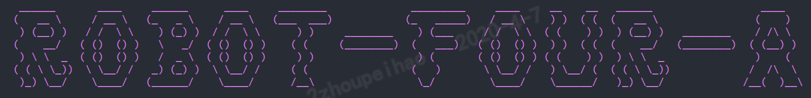
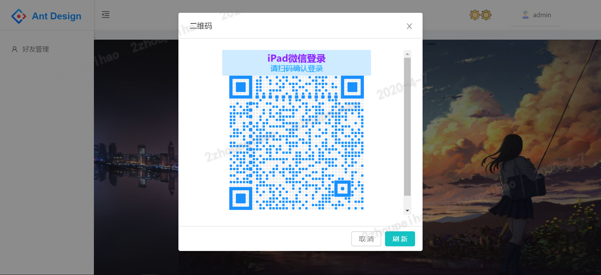

<p align="center">
    
</p>

# robot-four-a - 一个拥有四端的微信机器人应用程序 MVP

## 🔍robot-four-a 萌新？

没错，robot-four-a 是一个萌新，前端采用 React + Ant Design，后端分三端，监听端(listen-server)、存储端(store-server)、API 端(api-server)。  
当然了，没有 github 上一款 7.4k+的开源微信 SDK [Wechaty](https://github.com/wechaty/wechaty)，这个萌新就无法打怪升级走上人生巅峰，最下面的 [API](#⚡ wechaty 源码 功能 API) 很重要噢。

## ⚔️ 产品的灵感

  
基于这张黑板图做的一些思考，同时参考了 github 上一个 Vue + TypeScript 项目[aiyou-wechaty-robot](https://github.com/aiyoudiao/aiyou-wechaty-robot)，  
于是我做出了这个拥有四端的微信机器人 MVP，入门可以看看[aiyou-wechaty-robot 的 readme.md](https://github.com/aiyoudiao/aiyou-wechaty-robot/blob/master/README.md)中的说明。

## 🚀 技术选型

1. 前端：React 全家桶 + Ant Design UI
2. 监听端(listen-server)：TypeScript + Typeorm + RabbitMQ + **Wechaty** + Koa2
3. 存储端(store-server): TypeScript + Typeorm + RabbitMQ + Koa2
4. API 端：Nodejs + Koa2 + WebSocket + MySQL

## ✨ 效果展示

  


## 📚 使用

### ⚙️ 前端(react-app )

1. 切换到 react-app 目录
2. 安装依赖
3. 运行程序
4. 浏览器访问 `http://127.0.0.1:3000` 进入页面

```bash
cd react-app;
npm i;
npm run start
```

### ⚙️ 监听端(listen-server)

1. 切换到 listen-server 目录
2. 安装依赖
3. 在 src/app/config 目录下的配置文件，设置 token
4. 在 RabbitMQ 消息队列中添加相关的设置项
5. 运行程序
6. 浏览器访问 `http://127.0.0.1:8989` 来启动监听服务

```bash
cd listen-server;
npm i;
# 设置token...
# 设置RabbitMQ设置项...
npm run start:dev
```

### ⚙️ 存储端(store-server)

1. 切换到 store-server 目录
2. 安装依赖
3. 在 RabbitMQ 消息队列中添加相关的设置项
4. 在 ormconfig.js 中设置数据库相关配置项
5. 运行程序
6. 访问 `http://127.0.0.1:8999` 来启动存储服务

```bash
cd store-server;
npm i;
# 设置RabbitMQ设置项...
# 设置typeorm配置项...
npm run start:dev
```

### ⚙️ API 端(api-server)

1. 切换到 api-server 目录
2. 安装依赖
3. 在 /config/db.js 中设置数据库相关配置项
4. 运行程序
5. 访问 `http://127.0.0.1:8888` 来启动 API 接口服务

```bash
cd api-server;
npm i;
# 设置mysql配置项...
npm run start
```

## 后续优化

1. 添加 pm2 脚本支持，就可以使用一行命令来启动所有服务。
2. 添加 jest 测试支持。
3. 添加 docker 脚本支持，自动部署。
4. 完成其它功能模块
   - 群消息记录
   - 消息自动回复
   - 自动添加好友
   - 在线聊天室

## ⚡ wechaty 源码 功能 API

1. contact-self.ts
   - 设置或者获取自己的头像
   - 获取自己的二维码
   - 设置或者获取自己的机器人昵称
   - 设置自己的机器人签名
2. contact.ts
   - 说话，也就是发言，支持 文本、联系人信息（推荐联系人的小卡片）、文件、小程序、网址链接
   - 获取联系人的昵称
   - 获取或者设置获取清除联系人的别名
   - 判断该联系人是否是陌生人，已过期，使用 Contact#friend 中的方法来进行判断
   - 判断该联系人是否是你的好友
   - 判断该联系人是否是官方账号，已过期，使用 Contact#type 中的方法来判断
   - 判断该联系人是否是个人账号，已过期，使用 Contact#type 中的方法来判断
   - 返回该联系人的类型，未知或者官方账号或者个人账号
   - 判断该联系人是否是星级好友，强烈关注的那种好友
   - 返回该联系人的性别
   - 返回该联系人的省份
   - 返回该联系人的城市
   - 返回该联系人的头像
   - 返回该联系人所有的标签
   - 刷新该联系人的所有信息，已过期，使用 Contact#sync 中的方法来刷新
   - 同步该联系人的所有信息
   - 加载联系人数据，框架内部使用
   - 是否成功加载完联系人数据
   - 检查该联系人是否是自己
   - 获取该联系人的微信号
   - 根据 id 来加载 pool 某个联系人
   - 根据别名、id、昵称、微信号来查找某一个联系人
   - 根据别名、id、昵称、微信号来查找所有联系人
   - 删除某个联系人，但未实现
   - 获取联系人列表中所有标签(分组)
3. favorite.ts
   - 返回收藏列表中所有的标签，待实现
   - 查找收藏夹中的所有内容，待实现
   - 返回收藏列表，有待实现
4. friendship.ts
   - 获取当前好友请求的类型以及该好友的 id
   - 是否成功加载所有好友请求
   - 加载机器人自己的所有好友请求
   - 接受好友的请求
   - 获取好友的请求消息，就是好友请求打招呼的文本字符串
   - 从好友请求中获取该联系人
   - 获取好友请求的类型
   - 获取好友请求的载体 json 字符串
   - 通过好友请求的载体 json 字符串来加载一个新的好友请求，那么你就可以 accept 来接受好友请求。
   - 根据 id 来加载一个新的好友请求
   - 通过微信号或者手机号搜索联系人，并返回该联系人
   - 向某个联系人发送好友请求，已过期，使用 Friendship#add 中的方法来发送好友请求
   - 向某个联系人发送添加好友的请求
   - 删除某个好友请求，待实现
5. image.ts
   - 获取一个缩略的图片文件对象
   - 获取一个高清的图片文件对象
   - 获取一个超清的图片文件对象
   - 根据 id 创建一个图片对象
6. message.ts
   - 从 from、text、room、type、to 来从缓存中查找一条消息
   - 从 from、text、room、type、to 来从缓存中查找所有相关的消息
   - 返回由消息类型、发消息的人、消息来自的群组、截取后只剩 70 个字节消息文本拼接而成的字符串。
   - 获取发消息的联系人
   - 获取收消息的联系人
   - 获取消息所在的群组
   - 获取消息的文本内容，已过期，使用 Message#text 中的方法
   - 获取消息的文本内容
   - 获取被撤回的消息
   - 发消息，支持多种类型字符串 | 联系人 | 文件对象 | 资源链接 | 小程序
   - 撤回当前这条已发送的消息
   - 获取消息的类型
   - 检查这条消息是否是自己发送的
   - 获取消息中提交到的联系人列表
   - 获取中去掉提及人的纯文本内容
   - 获取消息中提交到的联系人列表，已过期，请使用 Message#mention 中的方法
   - 判断消息是否提及到自己
   - 是否加载消息完毕
   - 加载消息
   - 转发收到的消息给某个联系人或者某个群组
   - 获取消息发送的日期
   - 收到消息的延迟时间
   - 获取消息中的文件，已弃用，使用 Message#toFileBox 中的方法
   - 获取消息中的多媒体文件
   - 获取消息中的图片文件
   - 从消息中的推荐好友卡片中获取该推荐联系人
   - 获取消息中的网址链接
   - 获取消息中的小程序
   - 根据 id 来加载某条消息
   - 根据 id 来创建某条消息，调用了 load 方法
7. mini-program.ts
   - 获取小程序的 appid
   - 获取小程序的 title
   - 获取小程序的页面路径
   - 获取小程序的用户名
   - 获取小程序的描述
   - 获取小程序缩略图 url
   - 获取小程序的缩略图 key
8. room-invitation.ts
   - 输出群组邀请信息的字符串
   - 输出更详细的群组邀请信息字符串
   - 接受群组邀请
   - 从群组中获取邀请人
   - 获取群组的主题
   - 获取群组的主题，已废弃，请使用 topic
   - 获取群组中的成员数量
   - 获取群组中的成员数量，已废弃，请使用 memberCount
   - 获取群组中的联系人
   - 获取群组中的联系人，已废弃，请使用 memberList
   - 获取邀请时间
   - 获取发送邀请和接受到邀请之间的时间间隔
   - 将群组邀请对象持续化成一个 json 字符串
   - 加载一个新的群组邀请对象
   - 从持久化 json 字符串中加载一个群组邀请对象
9. room.ts
   - 返回拼接后的群组名称
   - 刷新数据，已过期，请使用 sync
   - 强制同步数据
   - 加载群组数据，内部使用
   - 是否加载完毕
   - 在群里发送 文本、文件、url、小程序
   - 发送模板字符串数组，也就是发送多条数据，say 中调用它，它是个私有的方法
   - 发送群事件信息 邀请入群 离开群 发消息 加入群 改变群名称
   - 监听群事件 邀请入群 离开群 发消息 加入群 改变群名称
   - 添加一个联系人到群里来
   - 从群里删除一个联系人
   - 退群
   - 获取或者设置群名称
   - 获取或者发布群公告
   - 获取群二维码
   - 创建一个群组
   - 根据条件查找所有群组
   - 通过条件查询到某个群组
   - 根据 id 来加载某个群组
